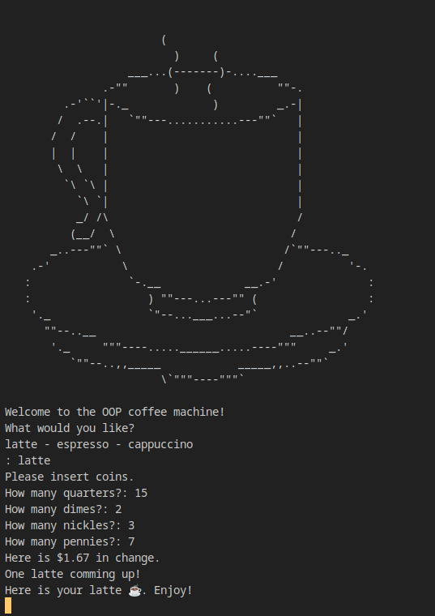

# Day_016 - Coffee maker vending machine

On day 16, we took the coffe maker vending machine made in day 15 and rebuilt it with OOP standarts.

The machine serves three types of coffee, has a resource system behind it, (meaning that, if there aren't enough resources, coffee can't be made), and has a money pay/exchange system behind it.

There are also a few commands for the machine administrators to refill and oversee it.

