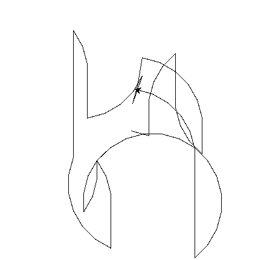

# Day_019 - Etch a Sketch & Turtle bet race

Day 19 was focused on further practising with the Turtle module.

Two mini-projects were created.

- An etch a sketch board, which allowed for "free" drawing with a turtle:

    

- A turtle racing bet mini-game, were the player placed a bet on a turtle and if they were lucky, they would win the bet:

    
