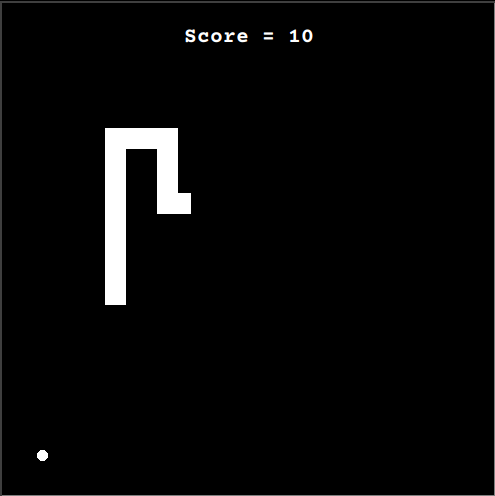

# Day_021 - Snake Game

The following is a simple snake game, making use of Python's turtle module.
The game game makes use of OOP concepts like inheritance and classes in order to create the snake, food, scoreboard and the window itself.
Some modifications were made to the original code, among them, the ability to restart a new game on key press after losing the current one.

  

