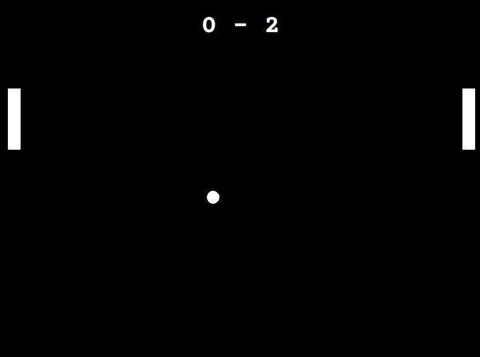

# Day_022 - Pong Game

The following is a simple pong game, making use of Python's turtle module.

The game game makes use of OOP concepts like inheritance and classes in order to create the paddles, ball, scoreboard and the window itself.

Everytime the ball is bounced back by a player, it's speed slightly increases.

