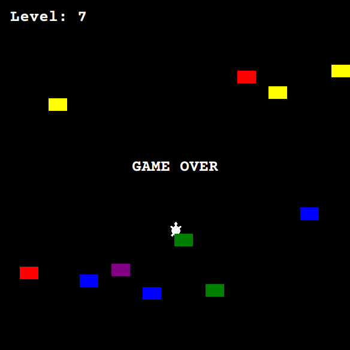

# Day_023 - Turtle Crossing Game

Day 23 had us create a crossing game.

This game makes use of all Turtle and OOP concepts learned on past days.

The game is simple, the player has to reach the top edge to increase the level.

With every level increase, the car spwn frequency and movement speed increase.

