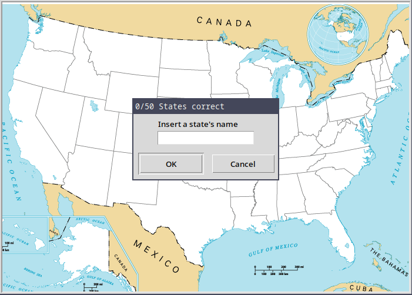

# Day_025 - U.S States Game

On day 25, the main goal was to get started with pandas, by creating a game that made use of dataframes and other methods from the library.

This game was the U.S States Game. The U.S States Game is a game where you have to guess every state in the U.S.

A map of the U.S is presented with a dialog box to receive input from the user and with each correct guess, a name will appear on the state's area.

