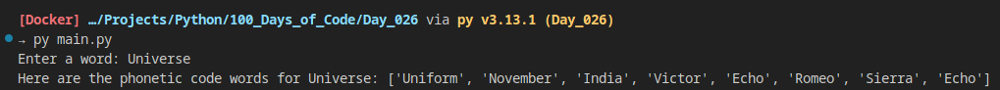

# Day_026 - List Comprehension

Day 26 was focused on learning the concept of list comprehension and explore it by working with dictionaries, lists and the pandas library.

By the end of the day, a little program was created that returned the NATO phonetic code for a word inserted by the user:

