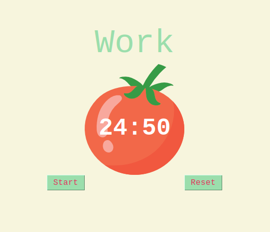

# Day_028 - Pomodoro app

Day 28 was focused on buiding a pomodoro app with the Tkinter module.

The pomodoro technique consists on taking 25 min long work sessions, 
each followed by a 5 min long short break and at the end of the 3rd 
work session, a 20 min long break.

By the end of the day, the following program with a pomodoro GUI was created:

