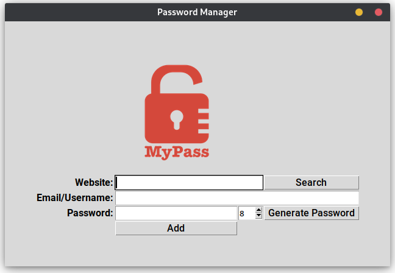
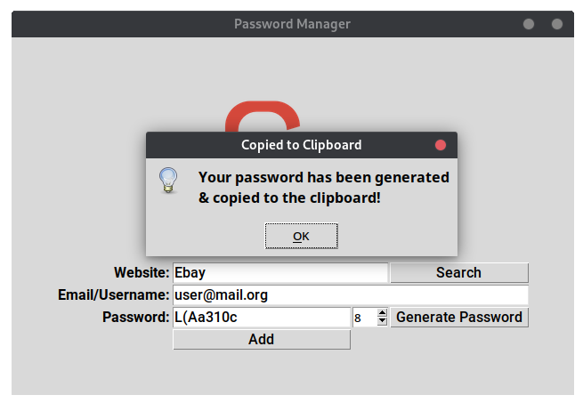

# Day_029 - Password Manager app

Day 29 was focused on creating a password manager, using the Tkinter module.

It's a simple password manager, that allows you to store yur entries in
a JSON file with Website keys.

The passwords can be randomly generated and copied to the clipboard, using
the pyperclip module.

**Note:** Do not use this app as your password manager, the data is stored locally,
in plain text!

By the end of the day, the following program was created:

