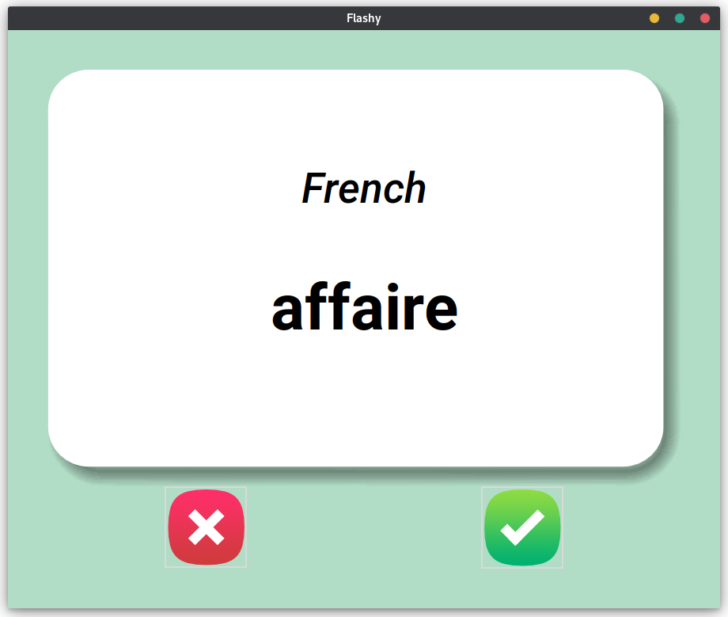
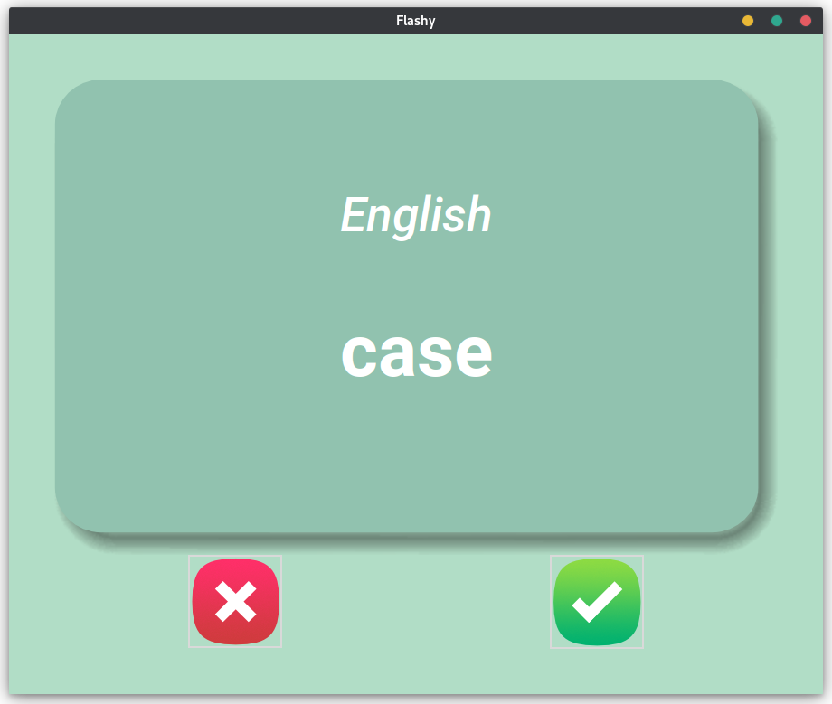

# Day 31 - Flash Card App 

Day 31 was focused on creating a flash card app.

This app makes use of tkinter and pandas to create a GUI that presents the front of a card with a word in french.

After a 3s delay, the card flips with the corresponding word in English the user then selects if he knew the English match or not.

The known words are written to a csv file that is used to save the user's progress.

Here is a preview of the app:

