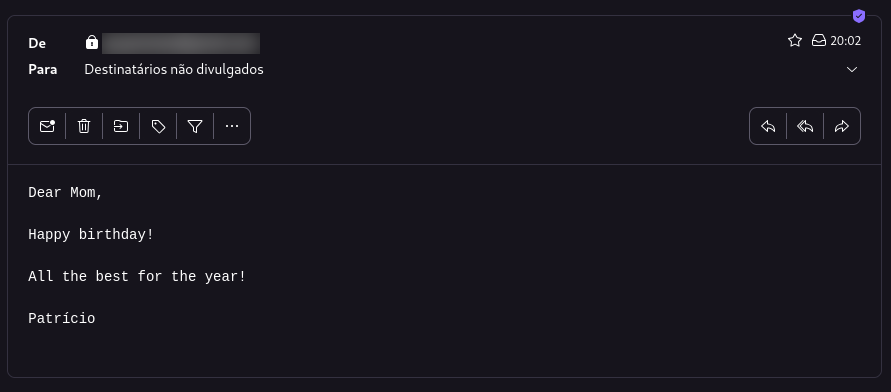

# Day 32 - Automated Happy Birthday E-mail Sender 

Day 32 was focused on exploring Python's smtplib & e-mail sending capabilities.

By the end of the day, an automated happy birthday e-mail sender was created.

It fetches template data from a csv file, using pandas and after making some changes to the template, it proceeds to send an e-mail to the e-mails of the contacts who's birthday is today.

After executing the script, those contacts should receive an e-mail similar to the following:

