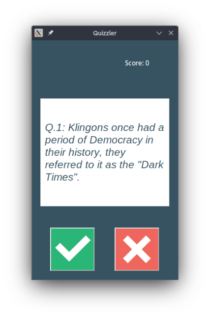

# Day 34 - Quiz Brain

On Day 34, the quiz brain app from day 17 was revisited and had some improvements, namely: 
- A UI was added to it, using the tkinter module.
- Instead of having the questions all stored locally on a file, calls to the open trivia API are now being made, in order to fetch the questions randomly.

Here is a preview of the new app:

