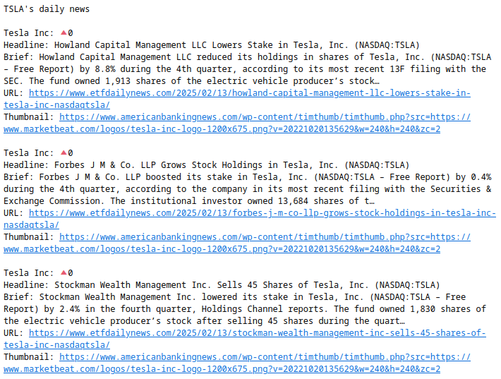

# Day 36 - Stock market script

On day 36, the goal was to create a script that was responsible for commuinicating with two different APIs.

The first, used to fetch the stock prices of a given company, and the sconds, to fetch news related to that company, if there was a significant stock price increase/decrease on the previous day.

These news, are then processed and sent by email, which has the following structure:

