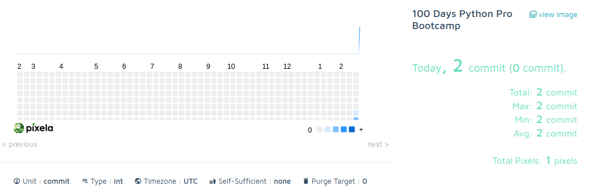

# Day 37 - Commits graph

Day 37 was a short day, on this day, the goal was to play around with the Pixela API and explore it's capabilities, having a deeper understanding of HTTP requests.

Pixela allows you to create commit graphs, similar to the ones in GitHub/GitLab.

This script has 3 HTTP requests, for creating, updating and deleting commits from a graph.

The end result was the following:

